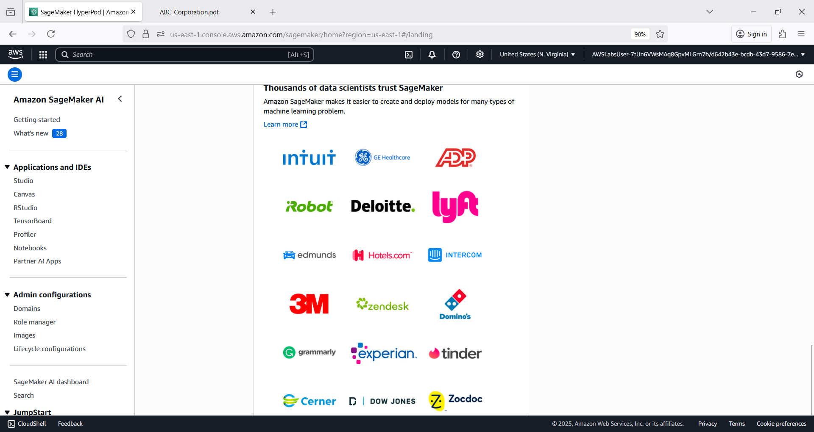
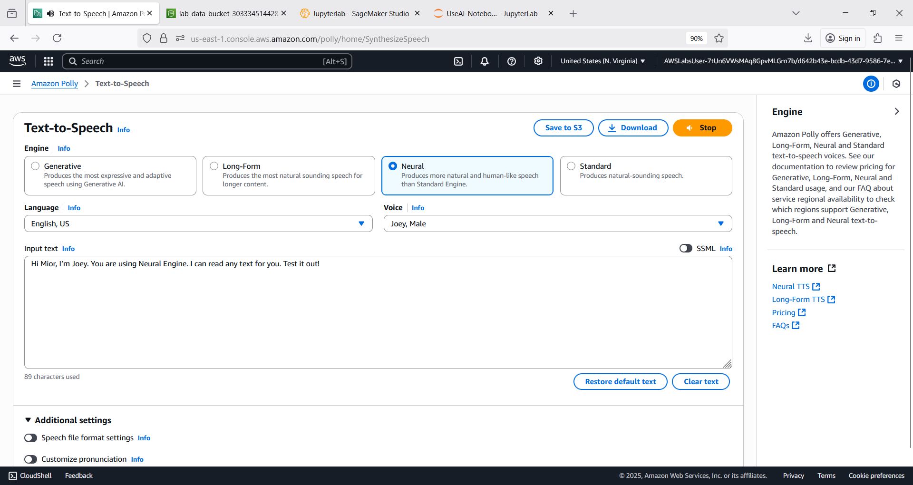
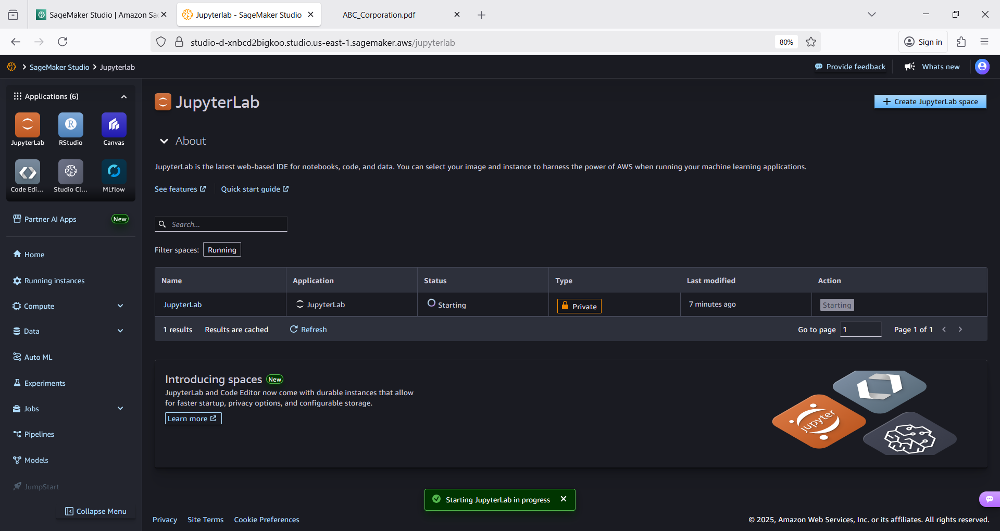
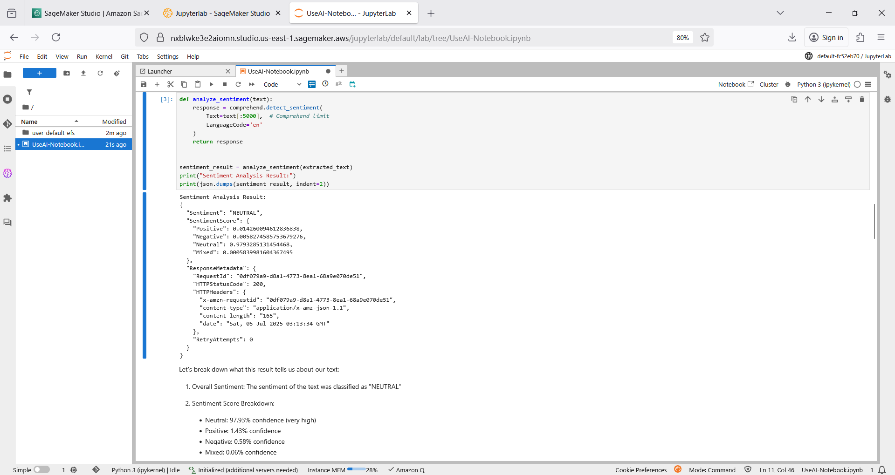
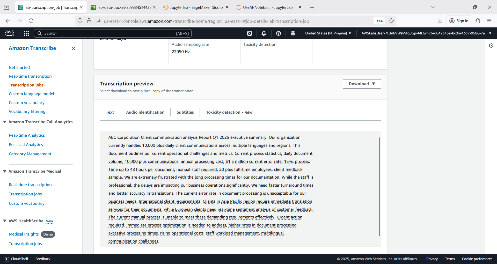

# ct3p 🍃🐑
ct3p : AI Global Consulting Service # Amazon Comprehend # Textract # Translate # Transcribe # Polly # SageMaker AI # S3

## Objective
- Extract text from PDF documents (S3) with Amazon Textract.
- Analyze sentiment of extracted text with Amazon Comprehend.
- Convert text between languages with Amazon Translate.
- Convert written text to natural-sounding speech with Amazon Polly.
- Convert audio recordings back to text with Amazon Transcribe.
- Leverage Boto3 SDK

## Comprehend Textract Translate Transcribe Polly SageMaker AI

