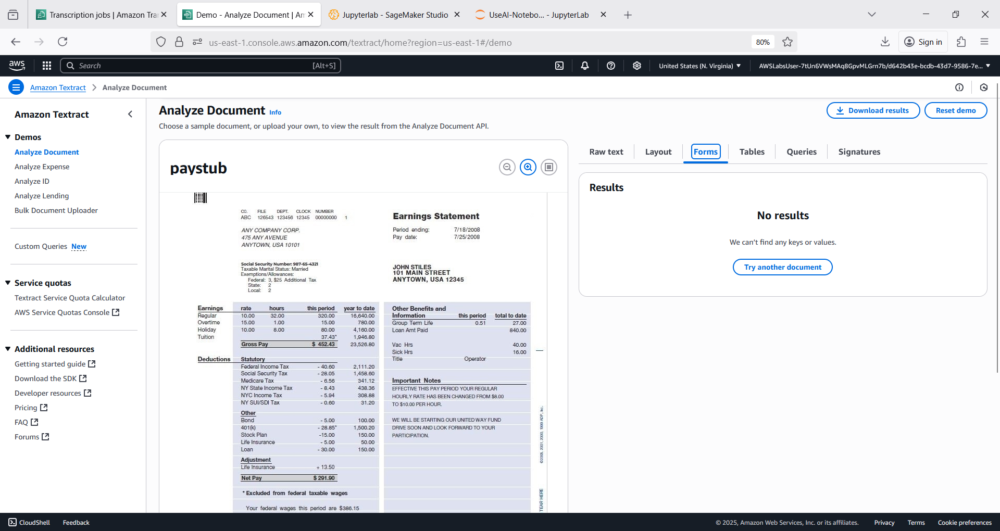
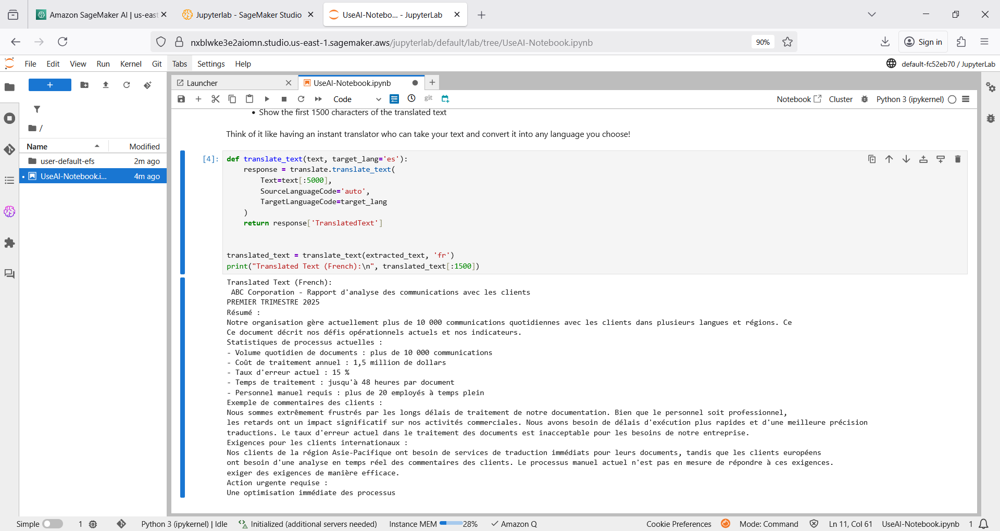
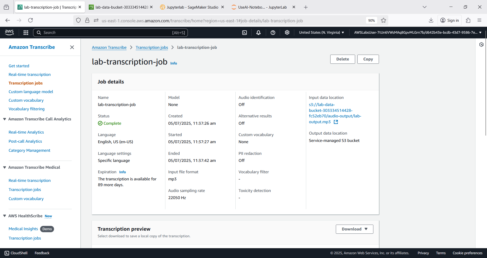
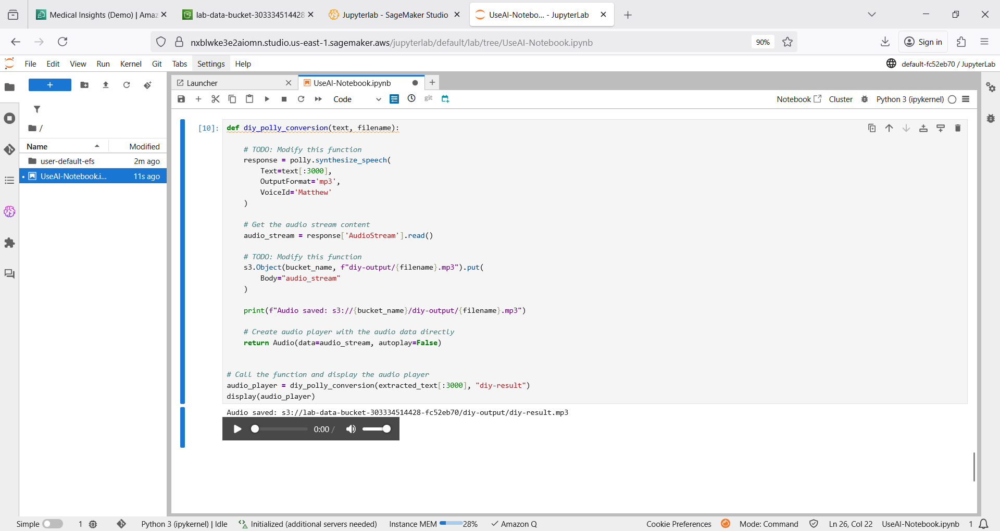
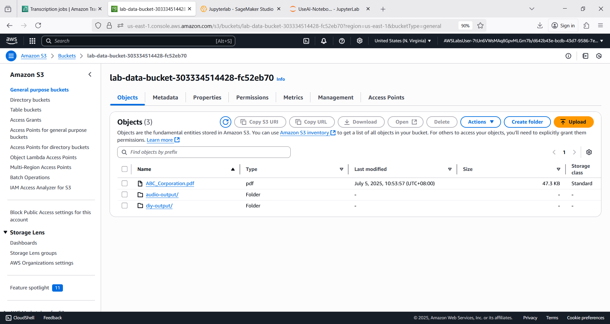

# ct3p 🍃🐑
ct3p : AI Global Consulting Service # Amazon Comprehend # Textract # Translate # Transcribe # Polly # SageMaker AI # S3

## Objective
- Extract text from PDF documents stored in Amazon S3 by using the Boto3 SDK with Amazon Textract.
- Analyze the sentiment of extracted text by using the Boto3 SDK with Amazon Comprehend.
- Convert text between languages by using the Boto3 SDK with Amazon Translate.
- Convert written text to natural-sounding speech by using the Boto3 SDK with Amazon Polly.
- Convert audio recordings back to text by using the Boto3 SDK with Amazon Transcribe.

## Comprehend Textract Translate Transcribe Polly SageMaker AI

